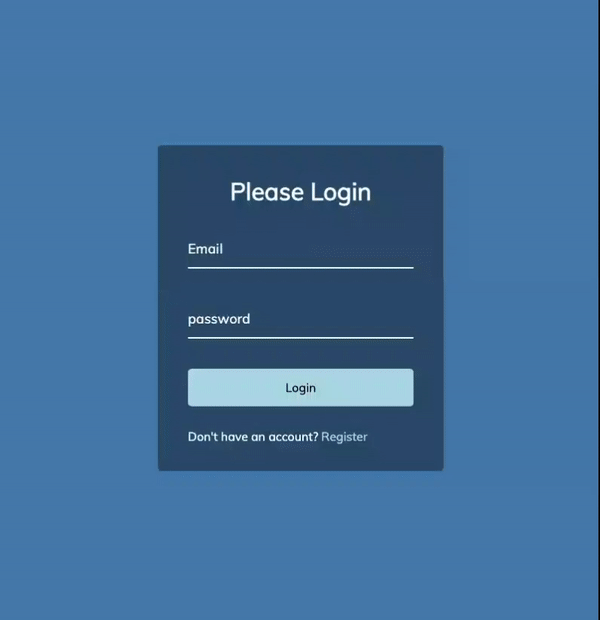

# Form Input Wave

This is a login page created using HTML, CSS, and JavaScript. The login page allows the user to enter their email and password to log in. When the user clicks on the email or password input section, each letter waves up as you type.

## Installation

To run this project, you need to clone the repository to your local machine. You can do this by opening the command line and typing:

`git clone https://github.com/IqbalAhmadi/form-input-wave.git`

Once you have cloned the repository, open the `index.html` file in a web browser to view the login page.

## Usage

To use the login page, click on either the email or password input section to start typing. Each letter will wave as you type.

## Demo

## Contact

If you have any questions or feedback, please feel free to contact me [here 📧](iqb.ahmadi@gmail.com).
